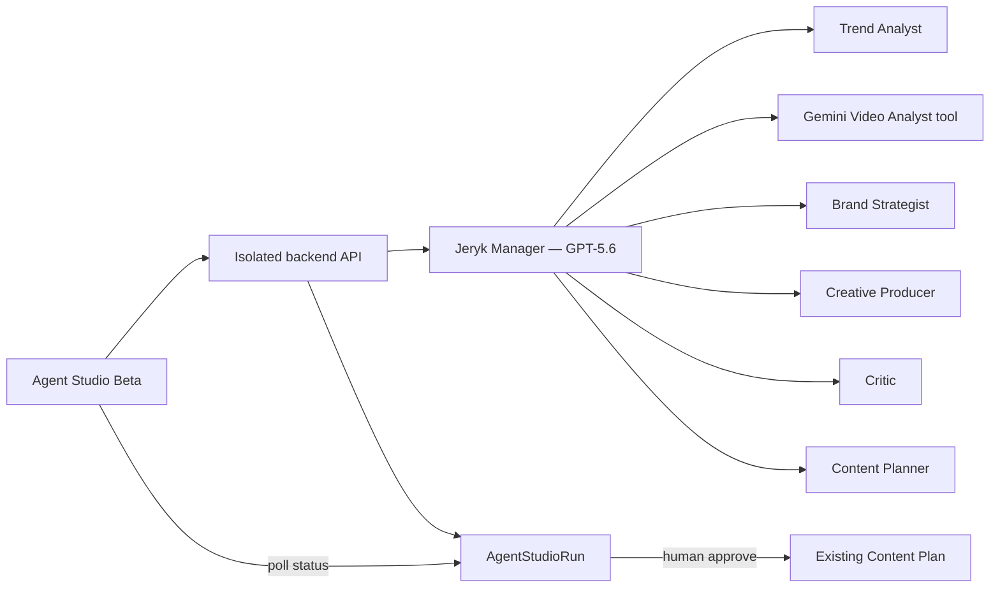

# DZHERO Agent Studio Beta — OpenAI Build Week Design

**Date:** 2026-07-14

**Status:** Ready for implementation planning

**Branch:** `hackathon/openai-build-week`

**Product rule:** This is an isolated, additive beta. Existing Signals, Studio, Gemini remix, Jeryk, Brand Brain, and Content Plan flows must keep working unchanged.

## 1. Hackathon story

DZHERO helps a small business owner who has run out of content ideas turn either a discovered trend or a specific Reel into a brand-safe, shoot-ready content package.

The three-minute judge demo uses a small Kyiv coffee shop:

1. The owner opens **Agent Studio Beta**.
2. They choose either **Find a trend for me** or **Adapt a Reel**.
3. Jeryk manages a visible team of specialized agents.
4. The team produces one polished Reel, two compact alternatives, and a seven-day content plan.
5. The owner reviews the evidence and agent decisions, approves the result, and sends it to the existing Content Plan.

The differentiator is not “many agents.” It is a verifiable path from a real signal through video evidence, brand adaptation, critique, and an actionable publishing plan.

## 2. Scope and non-goals

### In scope

- A separate English-first `Agent Studio Beta` page behind `ENABLE_AGENT_STUDIO`.
- Two entry modes that converge on one orchestration pipeline.
- OpenAI Agents SDK for the manager and specialist agents.
- GPT-5.6 as the configured OpenAI model for the hackathon path.
- Gemini retained as the specialized video-analysis tool.
- Real backend stage updates displayed through polling.
- Structured outputs validated before the next stage runs.
- One bounded critic revision.
- One primary Reel, two alternatives, and a seven-day plan.
- An explicit human approval step before writing to Content Plan.
- An honest fallback when a Reel cannot be accessed or analyzed.

### Not in scope for Build Week

- Replacing or migrating the current Studio/remix path.
- Autonomous Instagram publishing.
- Open-ended agent conversations or unlimited retries.
- A general-purpose agent builder.
- A durable distributed job queue or automatic resume after backend restart.
- A full cost/observability administration product.
- Automatic Brand Brain changes.
- Showing private prompts, hidden reasoning, or chain-of-thought.

## 3. User journeys

### Mode A — Find a trend for me

The user selects a business objective and optionally adds a short note. DZHERO uses existing signals and discovery infrastructure to select a suitable candidate. The selected signal and selection rationale are shown before or alongside the run.

The hackathon path must not depend on brittle, unapproved scraping. If live discovery is unavailable, it may use an already imported signal or a clearly labelled demo fixture.

### Mode B — Adapt a Reel

The user supplies one of:

- an existing DZHERO signal;
- a supported public video URL;
- an uploaded video, if the existing backend can safely accept it;
- a URL plus the user's notes when the video cannot be fetched.

If DZHERO cannot obtain reliable video evidence, it asks for one or two sentences about what happens in the video. User notes are labelled as notes and never presented as observations made by Gemini.

### Shared result

Both modes produce:

- `HeroReel`: complete hook, scene beats, dialogue or voice-over, on-screen text, shot list, CTA, and production notes;
- `AlternativeConcepts[2]`: shorter but meaningfully different directions;
- `ContentPlan[7]`: seven connected daily ideas using the same strategic insight without repeating the hero Reel;
- `PublicAgentTrace`: concise, safe explanations of what each stage observed or decided;
- `EvaluationSummary`: scores, blocking issues, revision notes, and final pass/fail status.

## 4. Architecture

The backend owns the state machine and invokes the OpenAI Agents SDK. Jeryk uses specialists as bounded tools; agents cannot invent new roles, change budgets, write directly to the workspace, or loop indefinitely.

### Agent responsibilities

| Agent | Responsibility | Required output |
| --- | --- | --- |
| Jeryk Manager | Chooses the permitted next step, assembles validated artifacts, and presents the final package | `FinalPackage` |
| Trend Analyst | Selects or evaluates a trend against the business objective | `TrendBrief` |
| Gemini Video Analyst tool | Extracts scenes, hook, twist, audio/text, mechanic, uncertainty, and evidence references | `EvidencePackage` |
| Brand Strategist | Maps the transferable mechanic to Brand Brain and the Ukrainian market | `BrandStrategy` |
| Creative Producer | Writes one complete Reel and two distinct alternatives | `CreativeBundle` |
| Critic | Checks grounding, originality, brand fit, feasibility, language, and CTA | `EvaluationReport` |
| Content Planner | Expands the accepted strategy into a coherent seven-day plan | `ContentPlan` |

## 5. Bounded orchestration

The backend executes the following state machine:

`queued → selecting_signal → analyzing_video → adapting_brand → producing → evaluating → planning → awaiting_approval → completed`

Terminal or alternate states:

- `needs_context` — reliable evidence is missing and user input is required;
- `failed` — a provider, validation, budget, or quality error stopped the run;
- `cancelled` — the user cancelled the run.

Rules:

1. Every agent receives only the validated artifacts it needs.
2. Every output uses a Zod-backed structured schema.
3. A malformed structured response gets at most one repair attempt.
4. The Critic may request at most one Creative Producer revision.
5. A second critic failure ends honestly as `failed: quality_rejected`.
6. The Content Planner runs only after the creative bundle passes.
7. Workspace writes occur only after explicit user approval.

## 6. Evidence and honest degradation

`EvidencePackage` separates source types:

- `video_observation`;
- `audio_observation`;
- `on_screen_text`;
- `source_metadata`;
- `user_note`.

Each evidence item has an id, source type, text, optional timestamp, and confidence. Creative claims about the source must reference evidence ids. Product claims must reference Brand Brain fields or be marked as a creative suggestion requiring confirmation.

If video analysis is unavailable:

1. Preserve any reliable metadata.
2. Set the run to `needs_context`.
3. Ask a specific question rather than generating a generic fake script.
4. Continue only after the user supplies notes or another source.

## 7. API surface

The beta uses isolated routes so existing APIs remain untouched:

- `POST /api/workspaces/:workspaceId/agent-studio/runs`
  - input: `mode`, `signalId` or `sourceUrl`, `objective`, optional `userNotes`, and `idempotencyKey`;
  - output: safe run representation and `runId`.
- `GET /api/workspaces/:workspaceId/agent-studio/runs/:runId`
  - output: status, current stage, safe trace entries, context request, result, or classified error.
- `POST /api/workspaces/:workspaceId/agent-studio/runs/:runId/context`
  - supplies user notes while in `needs_context`.
- `POST /api/workspaces/:workspaceId/agent-studio/runs/:runId/cancel`
  - prevents subsequent stages from starting.
- `POST /api/workspaces/:workspaceId/agent-studio/runs/:runId/approve`
  - accepts the hero or an alternative and optionally adds the approved package to Content Plan idempotently.

The frontend polls the run endpoint every 1–2 seconds while active. Progress comes from backend state, never cosmetic timers.

## 8. Minimal persistence

`AgentStudioRun` is stored through the existing workspace-aware storage abstraction and contains:

- ids for run, workspace, user, and selected signal;
- mode, objective, status, and current stage;
- sanitized inputs and validated artifacts;
- safe trace entries and classified errors;
- model/agent names, timestamps, attempts, and provider usage when available;
- approval state and Content Plan write id.

The run survives page refresh. Automatic restart/resume across a backend process crash is explicitly deferred for Build Week; a previously interrupted active run becomes a clear retryable failure instead of pretending to continue.

## 9. Public trace

The judge-facing trace shows concise facts and decisions, for example:

- **Trend Analyst:** “Selected a reveal mechanic because the coffee shop objective is in-store visits.”
- **Video Analyst:** “Observed a three-beat setup, interruption at 0:04, and product reveal at 0:08.”
- **Brand Strategist:** “Mapped the reveal to the shop's morning ritual and playful tone.”
- **Critic:** “Rejected an unsupported ‘best coffee in Kyiv’ claim; revised to a verifiable product detail.”

The trace does not expose raw prompts, private chain-of-thought, secrets, or full provider payloads.

## 10. Configuration and security

Required backend environment variables:

- `OPENAI_API_KEY` — server-side only;
- `OPENAI_AGENT_MODEL=gpt-5.6` — configurable for compatibility;
- existing Gemini variables for video analysis;
- `ENABLE_AGENT_STUDIO=true` — beta feature flag;
- optional per-run token/cost and timeout limits.

Security rules:

- Never place API keys in Vite/frontend variables, committed files, API responses, or logs.
- All routes enforce the existing session, origin, workspace ownership, and expensive-route limits.
- Source video, captions, websites, metadata, and user notes are untrusted data, not instructions.
- Agents receive no direct database, filesystem, shell, publishing, or arbitrary network tool.
- Errors shown to users are classified (`missing_key`, `quota`, `rate_limit`, `timeout`, `video_unavailable`, `invalid_output`, `quality_rejected`) and do not expose internals.

## 11. UI and demo language

- The Build Week experience, README section, demo narration, and Devpost submission are in English.
- Existing Ukrainian and English product modes remain intact.
- The beta page can default to English for the judge demo but must use the existing localization approach rather than hard-coded mixed-language UI.
- The page presents the two entry choices first, then real stages, evidence, output cards, and a clear approval action.
- Existing Jeryk UI remains unchanged; the beta may reuse the character and voice without replacing the current assistant.

## 12. Testing strategy

### Unit and contract tests

- schemas accept valid artifacts and reject missing evidence references;
- state transitions reject skipped or repeated stages;
- Critic revision is limited to one attempt;
- provider errors map to safe public errors;
- approval is idempotent;
- run access is workspace-scoped;
- secrets and hidden reasoning are redacted from trace/output.

### Integration tests

- both entry modes converge on the same pipeline using mocked provider responses;
- video failure enters `needs_context` and resumes with labelled user notes;
- one critic revision succeeds;
- a second quality failure stops the run;
- approval writes once to Content Plan;
- existing Gemini remix and Studio tests continue to pass.

### Demo acceptance test

A stable coffee-shop fixture completes the full visible journey in a demo-friendly time, while at least one pre-demo smoke run uses real OpenAI and Gemini calls. A provider outage during judging must be handled honestly; a fixture may be labelled as a prerecorded/demo recovery path, never as a live agent run.

## 13. Definition of done

The Build Week MVP is done when:

1. Both entry modes work and converge on the same isolated backend pipeline.
2. Jeryk and at least four visible specialist roles execute through the OpenAI Agents SDK with GPT-5.6.
3. Gemini provides evidence-backed video analysis or the run requests context.
4. The result includes one complete Reel, two distinct alternatives, and a seven-day plan.
5. The user sees real stage changes and a safe, useful agent trace.
6. The Critic visibly catches and corrects at least one meaningful issue in the demo fixture.
7. Approval adds the chosen result to the existing Content Plan exactly once.
8. Existing Signals, Studio, remix, Jeryk, and Content Plan behavior remains regression-tested.
9. API keys remain backend-only and provider/quota failures are explicit.
10. The English demo, public repository/README, and sub-three-minute video clearly explain the problem, architecture, OpenAI usage, Gemini role, and business value.

## 14. Implementation order

1. Add SDK/configuration, schemas, and mocked orchestration tests.
2. Build the isolated run state machine and API.
3. Connect the Agents SDK manager/specialists and Gemini analysis tool.
4. Add the English-first beta UI and polling.
5. Add approval-to-Content-Plan integration.
6. Run regression tests, prepare the stable coffee-shop demo, and document the architecture.
