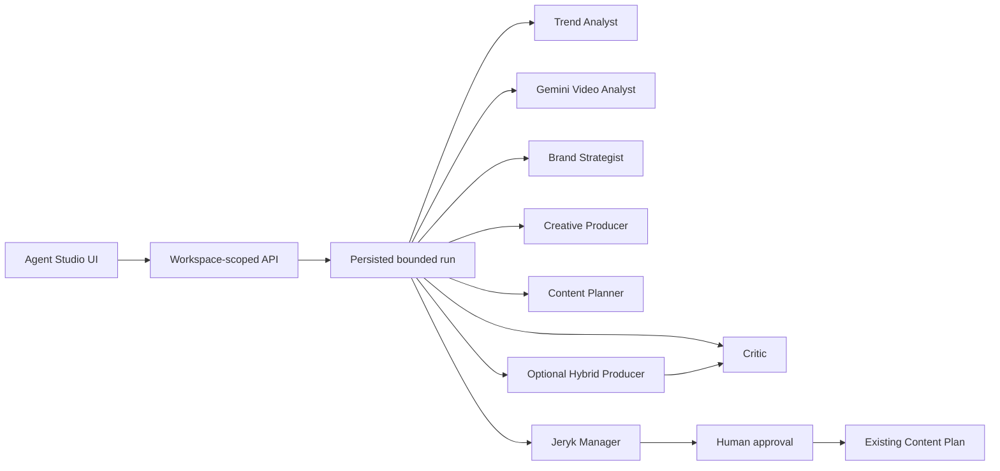

# DZHERO Agent Studio Beta — implemented design

**Original design date:** 2026-07-14

**Updated:** 2026-07-16

**Status:** Implemented and provider-verified

**Branch:** `hackathon/openai-build-week`

## Product boundary

Agent Studio is an isolated, additive Build Week beta. It does not replace the existing Signals, Gemini Studio, Brand Brain, Jeryk assistant, billing, localization, or Content Plan.

The pre-existing product provides workspace context and destination surfaces. The Build Week extension provides accountable OpenAI multi-agent production between one grounded signal and a human-approved weekly package.

## User journeys

### Find from my Signals

Trend Analyst selects a suitable item from the current workspace’s existing Signals for the supplied objective. The current MVP does not claim fresh whole-internet discovery.

### Adapt a Reel

The owner chooses an existing signal or a supported public video URL. The primary UI is URL-first. Authenticated upload and source-file endpoints remain backend recovery primitives and test surfaces, not the judge-facing primary path.

### Shared result

Both modes produce:

- one full hero Reel;
- two meaningfully different compact directions;
- grounded evidence with explicit provenance;
- Critic scores and revision requirements;
- a connected seven-day content plan;
- a safe public activity trace;
- a manager review awaiting human approval.

The owner may combine two directions through Hybrid Producer. Hybrid is a new OpenAI generation, Critic evaluation, plan generation, and Jeryk review.

## Architecture



OpenAI agents own reasoning and production. Gemini owns video observation. Source providers only resolve public media where required. The backend owns state, schemas, limits, error classification, persistence, telemetry, and all writes.

## Roles and contracts

| Role | Output responsibility |
| --- | --- |
| Trend Analyst | selected signal, mechanic, objective fit, rationale |
| Gemini Video Analyst | observed frames/audio/text, metadata, uncertainty, evidence ids |
| Brand Strategist | brand-specific strategic mapping and guardrails |
| Creative Producer | one full script and two distinct directions |
| Critic | scores, decision, stable revision requirements, blocking issues |
| Content Planner | exactly seven distinct content days |
| Hybrid Producer | one full script synthesized from two selected directions |
| Jeryk Manager | safe owner-facing review and approval package |

Every cross-stage artifact is schema-validated. Agents do not receive shell, direct database, publishing, or arbitrary network tools.

## Bounded state and recovery

Primary stages:

```text
queued
→ selecting_signal
→ analyzing_video
→ adapting_brand
→ producing
→ evaluating
→ planning
→ awaiting_approval
→ completed
```

Alternate terminal or pause states include `needs_context`, `failed`, and `cancelled`.

Rules:

1. A malformed structured response gets at most one repair.
2. Critic can request at most one standard creative revision.
3. Stable `REV-*` requirements survive revisions until explicitly resolved.
4. Final issues are classified as unresolved requirements, newly critical issues, or suggestions.
5. Planning runs only after creative acceptance.
6. A failed Hybrid restores access to the original useful package.
7. Approval is explicit and idempotent.
8. Backend interruption becomes a visible retryable failure rather than fake continuation.

## Grounding

Evidence types remain separate:

- `video_observation`;
- `audio_observation`;
- `on_screen_text`;
- `source_metadata`;
- `user_note`.

Creative source claims reference evidence ids. Brand choices reference Brand Brain fields. Metadata is never presented as a visual observation.

YouTube can use its native public URL. Instagram/TikTok resolution uses the configured source layer before temporary Gemini Files processing. Temporary provider files are deleted after analysis.

If evidence is insufficient, the run requests context or reports a classified source error. It does not fabricate a watched video.

## Creative quality gate

A full approvable script must include:

- a first-two-second pattern interrupt;
- hook, tension, development, proof, and CTA;
- at least three concrete scenes;
- shootable shot-by-shot instructions;
- evidence and brand references;
- practical production notes;
- acceptable grounding, brand fit, originality, feasibility, language, commercial fit, hook strength, mechanic fidelity, and creative boldness.

Compact alternatives are selectable inputs for Hybrid, but they are not directly approvable full scripts.

## Approval contract

Only a full hero or full Hybrid package can be approved.

The approved write contains exactly seven normalized Content Plan posts. The first item carries the selected full script, scenes, and production notes. Every day includes a distinct objective, hook, and CTA. A repeated approval returns the original write rather than duplicating posts.

## Public trace and telemetry

The UI exposes safe stage activity, decisions, evidence references, quality scores, and aggregate provider usage.

It never exposes raw prompts, hidden reasoning, credentials, authorization headers, provider payloads, or unsanitized errors.

Usage aggregation is bounded and deduplicated per provider call. OpenAI/Gemini costs are rate-card estimates; Apify cost may be provider-reported.

## API surface

```text
GET  /api/workspaces/:workspaceId/agent-studio/config
POST /api/workspaces/:workspaceId/agent-studio/uploads
POST /api/workspaces/:workspaceId/agent-studio/runs
GET  /api/workspaces/:workspaceId/agent-studio/runs/:runId
POST /api/workspaces/:workspaceId/agent-studio/runs/:runId/retry-source
POST /api/workspaces/:workspaceId/agent-studio/runs/:runId/source-file
POST /api/workspaces/:workspaceId/agent-studio/runs/:runId/context
POST /api/workspaces/:workspaceId/agent-studio/runs/:runId/cancel
POST /api/workspaces/:workspaceId/agent-studio/runs/:runId/hybrid
POST /api/workspaces/:workspaceId/agent-studio/runs/:runId/approve
```

All routes are authenticated, workspace-scoped, origin-protected where applicable, and rate-limited for expensive operations.

## Accepted limitations

- UI polling instead of server-sent events.
- Persisted run is not automatically restored after full refresh.
- No distributed durable queue.
- Public media can become unavailable.
- No autonomous publishing or Brand Brain mutation.
- Fresh external signal acquisition is a separate future capability.

## Definition of done — achieved

- Both entry modes converge on the same workflow.
- OpenAI specialist agents execute through structured contracts.
- Gemini provides grounded evidence or an honest pause/failure.
- Hero, alternatives, Hybrid, Critic, seven-day plan, and Jeryk review work.
- Human approval writes seven items exactly once.
- Safe trace and provider usage are visible.
- Focused Agent Studio verification and production build pass before submission.
- Judge-facing documentation distinguishes existing DZHERO from Build Week work.
